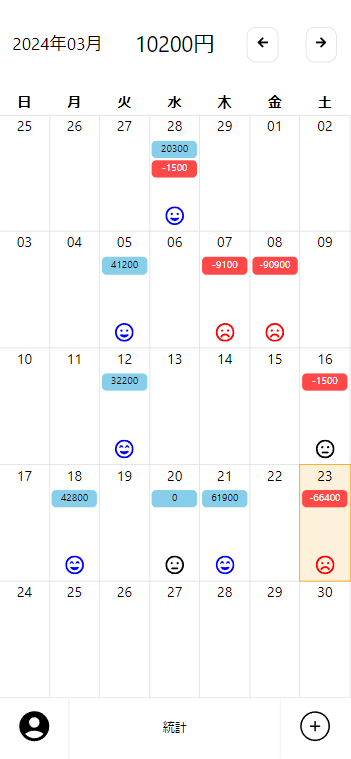
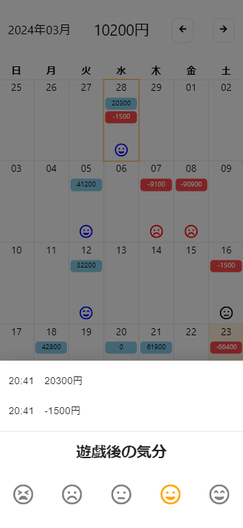
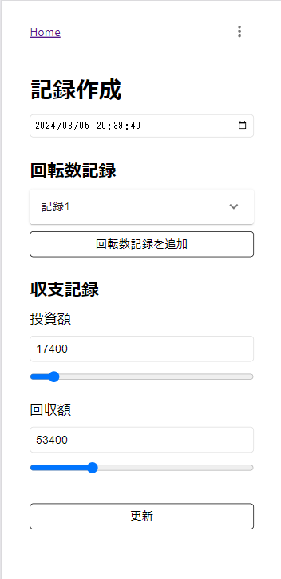
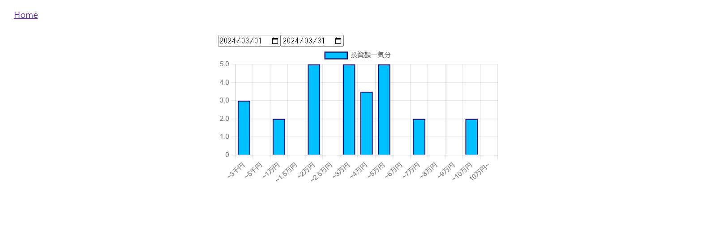
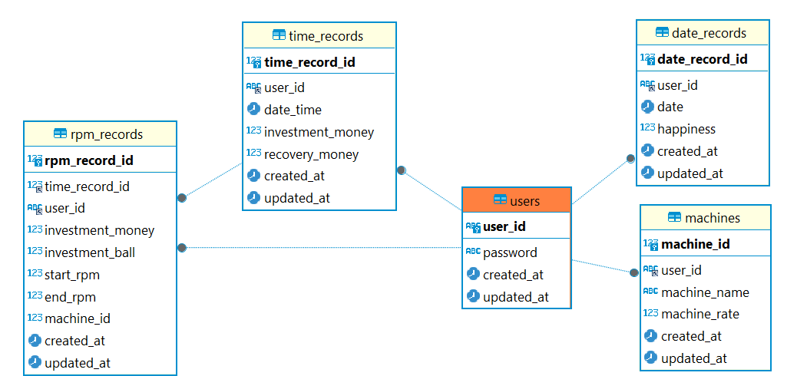

# P-Happy-Calendar

## 概要
パチンコの収支記録カレンダー

特徴は
1. その日の気分を記録
1. 気分と投資額などの関係をグラフ化

#

<div style="display: flex; justify-content: space-between;">
    
    
    
</div>

#




## サービスの目指す方向
1. 楽しむために行く頻度や使うお金の最適化
1. 気分の可視化で依存脱却の補助

## 使用方法
1. 新規登録、ログイン
1. 記録したい日付をタップ
1. 右下のプラスボタンを押して収支を記録
1. 日付をもう一度タップして気分を記録
1. 統計ページで自分が楽しんで使える金額を確認

## 今後の展望
1. 分析するデータの種類を増やす
1. 使用金額が多すぎる際に通知で散歩など気分を変える提案
1. 依存脱却、気分の最適化を目指すユーザーには位置情報からパチンコ店を通らないように道を誘導
1. 気分向上のためにコミュニティ機能の追加
1. ネイティブアプリ化

## 技術スタック
- フロントエンド
    - TypeScript
    - React
- バックエンド
    - Go
    - MySQL
    - Redis
- インフラ
    - Azure

## ER図


## Azure構成
> 作業中

|レイヤー|サービス|
|-|-|
|フロント|Static Web Apps|
|バックエンド|Container Apps|
|データベース|Azure Database / Cache|

## 開発環境構築
vscodeのdevcontainer内でコードを編集

### .env
`sample.env`を参考に`.env`を作成

### 起動
```
docker compose up -d
```

### アクセス
`http://localhost:80`にアクセス